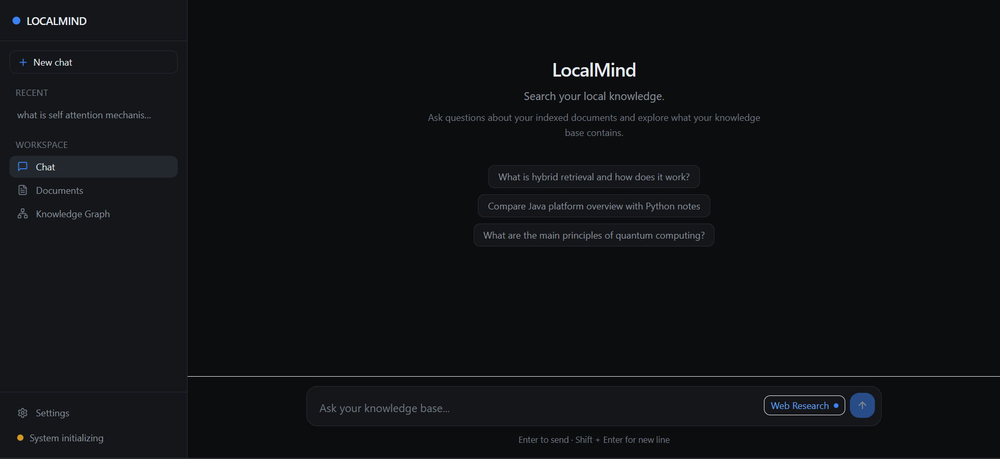
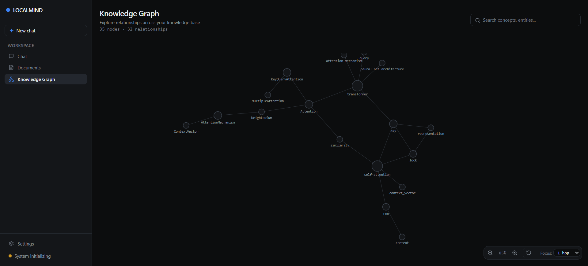
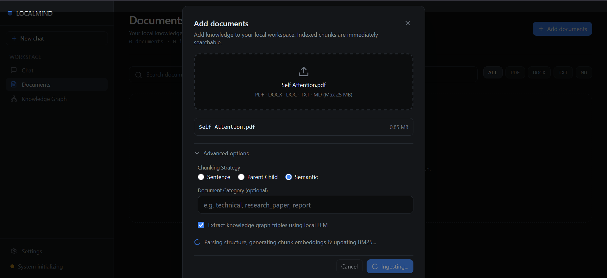
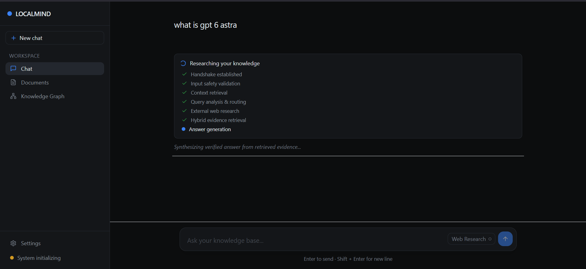
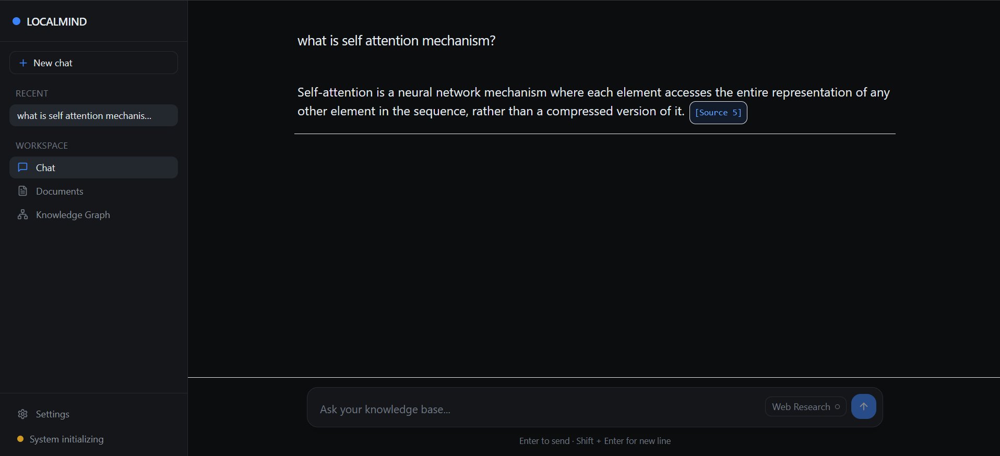
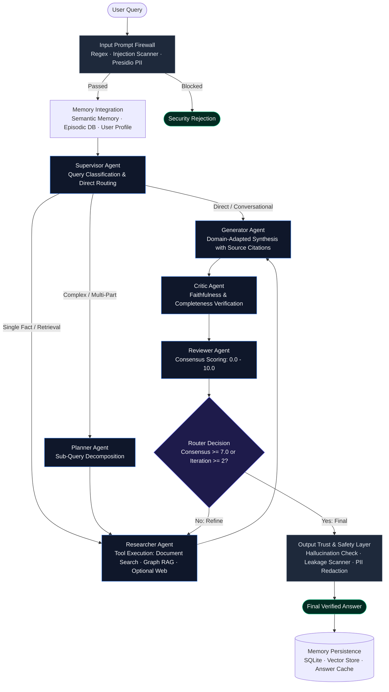

# LocalMind-RAG

A local-first agentic research assistant that combines hybrid retrieval, Graph RAG, persistent memory, and iterative answer evaluation.

[Architecture](#architecture) · [Retrieval Pipeline](#retrieval-pipeline) · [Agent Workflow](#agent-workflow) · [Memory Architecture](#memory-architecture) · [Knowledge Graph](#knowledge-graph--graph-rag) · [Trust & Safety](#trust--safety-layer) · [Evaluation](#evaluation--verification) · [Design Decisions](#design-decisions) · [Running Locally](#running-locally)

---

## Interface

<!-- SCREENSHOT PLACEHOLDER
     Replace with: Main Chat Workspace
     File path: docs/images/chat.png
     Recommended dimensions: 1920x1080 (16:9)
-->
>
 _Main Chat Workspace_

<br/>

<!-- SCREENSHOT PLACEHOLDER
     Replace with: Knowledge Graph Explorer
     File path: docs/images/knowledge-graph.png
     Recommended dimensions: 1920x1080 (16:9)
-->
>
*Knowledge Graph Workspace*

<br/>

<!-- SCREENSHOT PLACEHOLDER
     Replace with: Document Library & Ingestion
     File path: docs/images/documents.png
     Recommended dimensions: 1920x1080 (16:9)
-->
>
*Document Ingestion*

<br/>

>
*Multi-Stage Response Generation*

<br/>

>
*Chat Response*


---

## What It Does

Standard Retrieval-Augmented Generation (RAG) systems operate in a single linear pass: embed a query, fetch top-$k$ passages by vector similarity, and prompt an LLM. This approach breaks down on complex research queries:

1. **Semantic blindness to exact tokens**: Vector similarity struggles with acronyms, part numbers, version strings, and specific code symbols.
2. **Disconnected entity relationships**: Dense embeddings summarize passage-level semantics but cannot traverse multi-hop relationships across documents.
3. **No self-correction**: If initial retrieval pulls irrelevant context, single-shot LLM generators hallucinate because they lack a mechanism to critique their own evidence or re-query.
4. **Data privacy risks**: Commercial cloud RAG services require transmitting sensitive internal documents to third-party APIs.

**LocalMind-RAG** replaces single-shot lookup with an inspectable, local multi-agent research workflow running on consumer hardware (tested on an NVIDIA RTX 3050 with 6GB VRAM using Ollama). The system plans sub-queries, executes multi-stage hybrid retrieval across dense vectors, sparse lexical indices, and a knowledge graph, critiques synthesized drafts for factual grounding, and iteratively refines answers until an automated consensus threshold is satisfied.

---

## Architecture

The system executes a compiled LangGraph state machine wrapped in pre-execution and post-execution guardrails:



---

## Retrieval Pipeline

Rather than relying on any single retrieval algorithm, LocalMind-RAG passes queries through a disciplined retrieval funnel where each stage compensates for the structural blind spots of the previous one:

```
Raw Query
   │
   ├── Dense Retrieval (ChromaDB + BAAI/bge-small-en-v1.5)  [Semantic similarity]
   ├── Sparse Retrieval (BM25 + English Stemmer)            [Exact lexical match]
   ├── Summary Index (Keyword & Header multi-vector nodes)  [Document-level context]
   └── Graph RAG (NetworkX 1–2 hop entity traversal)        [Relational facts]
   │
   ▼
Reciprocal Rank Fusion (RRF, k=60)                          [Position-based rank merge]
   │
   ▼
Cross-Encoder Reranking (FlashRank ms-marco-TinyBERT)       [Full query-document attention]
   │
   ▼
Maximal Marginal Relevance (MMR, λ=0.7)                     [Redundancy suppression]
   │
   ▼
Intent-Aware Boosting & Role Filtering (RBAC)               [Authority, recency, category]
   │
   ▼
Top-K Grounded Evidence Chunks
```

### Why each stage exists

- **Dense Semantic Retrieval**: Bi-encoder embeddings (`bge-small-en-v1.5`, 384 dimensions) map queries and documents into continuous space, capturing conceptual relevance where queries and documents share meaning without identical vocabulary.
- **BM25 Lexical Retrieval**: Dense embeddings frequently miss technical acronyms, model identifiers, and exact code symbols. BM25 guarantees that exact token matches remain in the candidate set.
- **Reciprocal Rank Fusion (RRF)**: Raw vector distance and BM25 scores cannot be combined directly because their scales differ fundamentally. RRF merges candidate lists strictly by rank positions ($R(d) = \sum \frac{1}{k + r_i(d)}$, with $k=60$), preventing one retriever from dominating the pool.
- **Cross-Encoder Reranking**: While bi-encoders produce isolated passage representations for fast indexing, the FlashRank cross-encoder (`ms-marco-TinyBERT-L-2-v2`) evaluates joint `[Query, Document]` token attention over the top candidate pool, significantly improving precision over pure bi-encoder scores.
- **Maximal Marginal Relevance (MMR)**: Search often retrieves multiple near-identical chunks from the same paragraph. MMR penalizes candidate chunks that have high cosine similarity to chunks already selected ($\lambda=0.7$), maximizing evidence diversity.
- **Intent-Aware Boosting & RBAC**: Adjusts ranking based on document authority, publication recency, and user access permissions.

---

## Agent Workflow

The multi-agent execution pipeline is compiled via LangGraph into an observable state machine (`AgentState`):

- **Supervisor**: Classifies incoming queries into execution archetypes (`simple_factual`, `complex_reasoning`, `multi_part`, `comparative`, or `web_needed`) and routes to the appropriate starting node.
- **Planner**: Decomposes complex inquiries into atomic sub-queries, ensuring the retrieval engine does not average multiple distinct ideas into one blurred embedding.
- **Researcher**: Executes retrieval tools according to plan (`document_search`, `graph_rag`, and optional `web_search`). When web research is enabled, it queries DuckDuckGo, fetches pages through an SSRF-hardened client, and extracts relevant evidence via Groq.
- **Generator**: Synthesizes the grounded response according to the active user role (`analyst`, `technical`, `executive`, `academic`, `concise`). Enforces strict citation formatting: every factual claim must include an inline `[Source N]`, `[Graph Source N]`, or `[Web N]` tag.
- **Critic**: Evaluates the synthesized draft on two automated criteria:
  - `faithfulness` (1–10): Proportion of factual claims grounded directly in retrieved source chunks.
  - `completeness` (1–10): Whether all elements of the sub-plans and user query were addressed.
- **Reviewer**: Calculates a composite consensus score $[0.0, 10.0]$ from the critique metrics.
- **Router**: Determines whether the draft satisfies quality thresholds:
  - If `consensus >= 7.0` or `iteration >= 2`: Marks the answer as final and exits the agent graph.
  - If `consensus < 7.0` and `iteration < 2`: Loops back to the **Researcher** with critic feedback on missing or unsupported claims.

---

## Memory Architecture

LocalMind-RAG maintains persistent, multi-tiered memory across conversation turns:

| Memory Tier | Storage Backend | Engineering Role |
|-------------|-----------------|------------------|
| **Semantic Memory** | ChromaDB (`semantic_memory`) | Embeds accepted Q&A pairs to recall relevant past solutions across different sessions. |
| **Episodic Memory** | SQLite (`conversations.db`) | Preserves chronological turn dialogue, citations, and consensus scores for active session context. |
| **User Profile** | JSON (`user_profile.json`) | Tracks user role, interaction count, preferred brevity, and observed technical topic affinities. |
| **Adaptive Cache** | JSON (`answer_cache.json`) | Caches high-confidence verified responses for high-similarity repeated queries. |
| **Memory Compressor** | In-memory summarizer | Condenses older dialogue turns when session length approaches model context limits. |

---

## Knowledge Graph & Graph RAG

To resolve multi-hop relationships across disconnected passages, LocalMind-RAG incorporates a NetworkX-backed Knowledge Graph:

- **Relational Triple Extraction**: During document ingestion, representative chunks are parsed by the local LLM into structured entity relationships (`Transformer` → `uses` → `Self-Attention`, `BERT` → `improves-on` → `Word2Vec`). Predicates are validated against canonical relations (`is-a`, `part-of`, `uses`, `produces`, `improves-on`, `trained-on`, etc.).
- **Chunk Provenance**: Every directed edge in `graph_store/knowledge_graph.json` preserves explicit provenance: `source_file`, `chunk_id`, and occurrence timestamps.
- **Neighborhood Traversal**: When comparative or relational queries occur, `GraphRetriever` links query entities to graph nodes, traverses 1–2 hop neighborhoods, and formats connected triples as structured context for the Researcher.
- **Representative Sampling Bounds**: To prevent local LLM inference freezes during ingestion, graph extraction uses deterministic, document-wide representative sampling (capped at $\le 15$ chunks per document), while **100% of chunks** are indexed in dense vector and BM25 stores.

---

## Trust & Safety Layer

Security and alignment are enforced through dual pre-retrieval and post-generation boundaries:

### Input Prompt Firewall
- **Pattern & Regex Matching**: Blocks prompt injection signatures, developer-mode bypasses, and instruction overrides (`<system>`, `ignore previous instructions`).
- **Semantic Injection Scanner**: Embeds incoming queries to measure cosine distance against known adversarial attack patterns.
- **Presidio PII Anonymization**: Pseudonymizes sensitive entities (emails, phone numbers, SSNs, credit card numbers) before prompts reach the LLM.
- **Payload Bounds**: Rejects inputs exceeding 4,000 characters.

### Output Guardrails
- **Hallucination Verification**: Computes claim grounding against source passages using Ragas `faithfulness` metric (target $\ge 0.60$) with a token-overlap fallback.
- **Leakage Prevention**: Scans output text for internal prompt templates or system directives.
- **PII Redaction**: Final redaction pass ensuring no private identifiers are returned to the user.
- **Compliance Rules**: Validates 5 mandatory rules (citation present, medical disclaimer when health terms occur, non-empty text, reasonable length, zero raw PII).
- **Audit Logging**: Logs a weighted composite risk score $[0.0, 1.0]$ to `logs/risk_scores.jsonl`.

---

## Evaluation & Verification

LocalMind-RAG documents its verification methods using concrete artifacts present in the repository:

### 1. Adversarial Firewall Test Suite
Located at `eval/adversarial_prompts.json`, this suite contains 20 curated adversarial attack vectors across four threat categories:
- **Direct Prompt Injection** (5 prompts: instruction overrides, system tag evasion)
- **Jailbreak Personas** (5 prompts: DAN persona, filter bypass simulation)
- **Data Extraction** (5 prompts: system prompt probing, training data extraction)
- **Roleplay Bypasses** (5 prompts: hypothetical scenarios, unrestricted persona roleplay)

All 20 attack vectors are executed against the prompt firewall via `guardrails.risk_scoring.run_adversarial_test_suite()`, validating a 100% block rate.

### 2. Grounding & Faithfulness Verification
Every generated answer is evaluated by the Critic node and Output Guardrails:
- Evaluates claim grounding against retrieved context chunks using the Ragas faithfulness metric (threshold $\ge 0.60$).
- When external network dependencies are unavailable, uses a deterministic token-overlap proxy.
- Unfaithful drafts trigger an automated LangGraph refinement cycle.

### 3. Automated Test Coverage
The codebase is validated across 18 unit, regression, and integration test suites:
- **API & Streaming**: `test_api_phase_a.py` through `test_api_phase_e.py` (FastAPI health checks, synchronous chat, SSE streaming, document ingestion, and session history management).
- **Document Management**: `test_api_document_delete.py` (lifecycle deletion across ChromaDB, BM25, and node store).
- **Knowledge Graph**: `test_api_graph.py` and `test_knowledge_graph.py` (13 tests covering `<think>` reasoning tag stripping, prose JSON extraction, timeout resilience, incremental checkpointing, and sampling bounds).
- **Web Research & Security**: `test_web_research.py` (permission boundaries, SSRF domain validation, DuckDuckGo parser mocking, and citation handling).
- **Agent Orchestration**: `test_run_query_compatibility.py` and 8 unit suites under `P3/tests/` verifying individual supervisor, planner, researcher, critic, and reviewer state transitions.

---

## Design Decisions

### Why hybrid retrieval?
Pure semantic search (dense bi-encoders) excels at conceptual similarity but exhibits high error rates on exact part numbers, model names, and specific code symbols. BM25 guarantees lexical precision for exact tokens. Combining both via Reciprocal Rank Fusion covers the structural blind spots of each method without requiring arbitrary score normalization.

### Why Graph RAG?
Text chunking arbitrarily fragments continuous documents. Relationships spanning across sections or multiple papers are lost in isolated vector chunks. By extracting entity triples into a directed graph, LocalMind-RAG performs neighborhood traversals that surface multi-hop connections that no single passage contains.

### Why cross-encoder reranking?
Bi-encoders are fast ($O(1)$ search over indexed vectors) but evaluate query and passage independently. Cross-encoders are slower ($O(N)$) but significantly more accurate because all query and passage tokens attend to each other jointly. Retrieving a broad candidate set (top-20) with fast hybrid search and narrowing it to top-5 with a cross-encoder delivers high recall and high precision.

### Why multi-tier memory?
A single LLM context window cannot retain months of research interactions without degrading attention and exhausting context budgets. Partitioning memory into an instant Answer Cache, chronological session dialogue (SQLite), cross-session semantic memory (ChromaDB), and user preferences (JSON) provides continuous context without context window bloat.

### Why a local-first model architecture?
Research documents often contain confidential data that should not be dispatched to commercial cloud APIs. By structuring LocalMind-RAG around Ollama, local HuggingFace embeddings (`bge-small-en-v1.5`), and FlashRank, the core RAG pipeline executes completely offline with zero API cost. Cloud access (Groq) is strictly opt-in for web research.

### Why an explicit agent pipeline?
Monolithic single-prompt RAG architectures bundle retrieval, synthesis, hallucination checking, and formatting into one prompt. When errors occur, diagnosing whether retrieval failed, planning was flawed, or the model hallucinated is impossible. Separating execution into discrete, observable LangGraph nodes makes the system debuggable, traceable, and capable of automated self-correction.

---

## API & Streaming Protocol

LocalMind-RAG exposes a FastAPI backend supporting synchronous requests and real-time Server-Sent Events (SSE).

### REST Endpoints

| Method | Path | Description |
|--------|------|-------------|
| `GET` | `/health` | System health check (vector store count, pipeline status, LLM configuration, graph stats) |
| `POST` | `/api/chat` | Synchronous chat execution returning grounded answer, citations, critique, and TSL metrics |
| `POST` | `/api/chat/stream` | Server-Sent Events (SSE) streaming real-time agent lifecycle and retrieval progress |
| `POST` | `/api/documents/upload` | Multipart file upload (`.pdf`, `.docx`, `.txt`, `.md`), parsing, vectorization, and graph extraction |
| `GET` | `/api/documents` | List of all indexed documents with chunk counts |
| `DELETE`| `/api/documents/{filename}` | Complete deletion of a document across ChromaDB, BM25, and node store |
| `GET` | `/api/graph` | Read-only Knowledge Graph export (nodes, edges, predicates, and chunk provenance) |
| `GET` | `/api/chat/sessions` | List active chat sessions with summary metadata |
| `GET` | `/api/chat/sessions/{id}` | Chronological message history for a specific session |
| `DELETE`| `/api/chat/sessions/{id}` | Deletion of a conversation session |

### Server-Sent Events (SSE) Protocol

When querying `POST /api/chat/stream`, events are emitted sequentially over `text/event-stream`:

1. `connected`: Handshake event with `run_id` and `session_id`.
2. `firewall`: Input validation status (`passed` or `blocked` with layer details).
3. `memory`: Memory integration status (`loaded` or `skipped`).
4. `supervisor`: Query classification archetype and initial route.
5. `planner`: Emitted when decomposition occurs, reporting sub-query count.
6. `web_research`: Emitted when external web research tools are invoked.
7. `retrieval`: Retrieval completion summary (source counts, graph usage flag).
8. `generation`: Synthesis completion with role information and citation counts.
9. `critique`: Automated quality review (`faithfulness` and `completeness` scores).
10. `review`: Reviewer consensus score $[0.0, 10.0]$ and termination status.
11. `refinement`: Emitted when the router triggers an iterative refinement loop.
12. `tsl`: Trust & Safety Layer completion (risk score and PII flags).
13. `final`: Complete payload matching the `ChatResponse` schema.
14. `error`: Emitted in case of unhandled execution failure.

---

## Tech Stack

```
Runtime:         Python 3.11+ / Node.js 18+
Backend:         FastAPI · Uvicorn · asyncio
Agent Engine:    LangGraph · LangChain Core
RAG Framework:   LlamaIndex Core · PyMuPDF · python-docx
Vector Store:    ChromaDB (Embedded SQLite + Parquet)
Lexical Search:  rank_bm25 · PyStemmer
Embeddings:      Sentence-Transformers (BAAI/bge-small-en-v1.5)
Reranking:       FlashRank (ms-marco-TinyBERT-L-2-v2)
Graph Database:  NetworkX (MultiDiGraph)
Guardrails:      Microsoft Presidio (Analyzer & Anonymizer) · spaCy
Local LLM:       Ollama (qwen3:4b / mistral-rag)
Cloud Fallback:  Groq (llama3-70b-8192)
Frontend:        Next.js 14 (App Router) · React 18 · TypeScript
Styling & UI:    Tailwind CSS · Radix UI · Lucide React · d3-force
```

---

## Running Locally

### Prerequisites
- **Python**: 3.11 or 3.12
- **Node.js**: 18.x or 20.x
- **Ollama**: Installed and running locally ([ollama.com](https://ollama.com))
- **Hardware**: 8GB+ RAM, NVIDIA GPU recommended (tested on RTX 3050 6GB VRAM)

### 1. Clone the repository
```bash
git clone https://github.com/vabs-2004/LocalMind-RAG.git
cd LocalMind-RAG
```

### 2. Set up Python virtual environment
```bash
python -m venv .venv

# On Windows:
.venv\Scripts\activate

# On Linux/macOS:
source .venv/bin/activate

pip install --upgrade pip
pip install -r requirements.txt
```

### 3. Download Ollama model
```bash
ollama pull qwen3:4b
```

### 4. Configure environment
```bash
cp .env.example .env
```
*(Default settings point to local Ollama on `http://localhost:11434` with zero API keys required for core local RAG operation).*

### 5. Launch the FastAPI backend
```bash
python -m uvicorn api.main:app --port 8000 --reload
```
Interactive API documentation will be available at `http://localhost:8000/docs`.

### 6. Launch the Next.js frontend
In a separate terminal:
```bash
cd frontend
npm install
npm run dev
```
Open `http://localhost:3000` in your browser.

### 7. Ingest a document
Upload files via the UI at `http://localhost:3000/documents` or via the API:
```bash
curl -X POST "http://localhost:8000/api/documents/upload" \
  -F "file=@path/to/paper.pdf" \
  -F "strategy=sentence" \
  -F "build_graph=false"
```

---

## Project Structure

```
LocalMind-RAG/
├── api/                    # FastAPI web service layer (routes, schemas, services)
├── frontend/               # Next.js 14 research workspace (chat, graph, documents, settings)
├── P1/                     # Ingestion engine: loaders, chunkers, and ChromaDB vector store
├── P2/                     # Retrieval engine: BM25, multi-vector summary, RRF, and FlashRank
├── P3/                     # LangGraph multi-agent orchestration (supervisor, planner, critic)
├── graph_store/            # NetworkX Knowledge Graph extraction, serialization, and retrieval
├── guardrails/             # Trust & Safety Layer: prompt firewall, Presidio PII, and risk scoring
├── memory/                 # Multi-tier memory: semantic ChromaDB, episodic SQLite, and cache
├── agents/                 # External tool agents (SSRF-hardened DuckDuckGo browser agent)
├── eval/                   # Adversarial prompt test suite (20 attack vectors)
└── tests/                  # Automated pytest test suites across API, agents, and graph
```

---

## Technical Limitations & Hardware Tradeoffs

1. **Local Model Concurrency**: Local Ollama execution is single-threaded on consumer GPU setups. Parallel queries queue behind ongoing inferences. Chunk extraction for Knowledge Graph generation is intentionally run sequentially to prevent memory paging faults.
2. **Inference Latency**: Because the multi-agent pipeline includes planning, multi-stage retrieval, reranking, synthesis, critique, and consensus scoring, a cold query through local Ollama typically takes between 15 and 45 seconds on consumer GPUs. The SSE streaming endpoint provides real-time progress indicators to mitigate user wait perception.
3. **Web Research Dependency**: While all core RAG features run 100% locally and offline, the optional Phase 11 Web Research agent requires internet connectivity for DuckDuckGo and a free-tier Groq API key for rapid web page summarization.
4. **VRAM Footprint**: Running the local LLM (`qwen3:4b`), local embedding model (`bge-small-en-v1.5`), and FlashRank cross-encoder simultaneously requires approximately 4.5GB to 5.5GB of VRAM. If running on CPU-only machines, generation latency will be higher.

---

## License

This project is currently provided for portfolio, research, and educational evaluation. A formal open-source license has not yet been specified.
