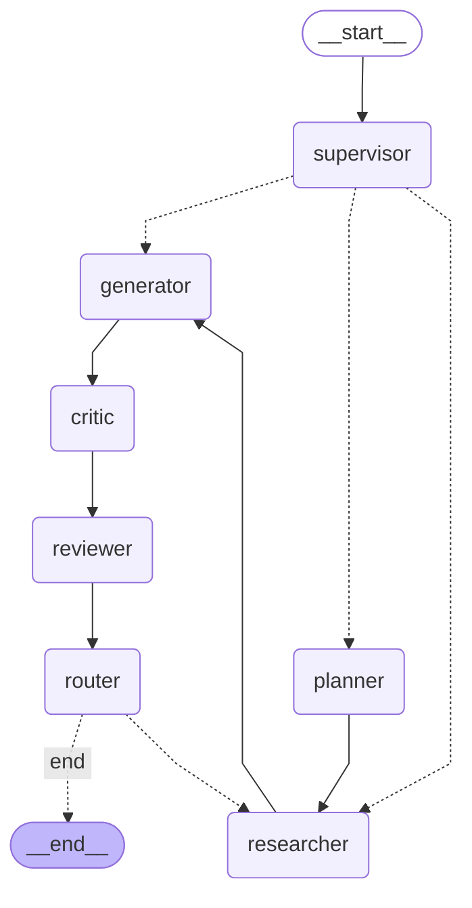

```mermaid
---
config:
  flowchart:
    curve: linear
---
graph TD;
	__start__([<p>__start__</p>]):::first
	supervisor(supervisor)
	planner(planner)
	researcher(researcher)
	generator(generator)
	critic(critic)
	reviewer(reviewer)
	router(router)
	__end__([<p>__end__</p>]):::last
	__start__ --> supervisor;
	critic --> reviewer;
	generator --> critic;
	planner --> researcher;
	researcher --> generator;
	reviewer --> router;
	router -. &nbsp;end&nbsp; .-> __end__;
	router -.-> researcher;
	supervisor -.-> generator;
	supervisor -.-> planner;
	supervisor -.-> researcher;
	classDef default fill:#f2f0ff,line-height:1.2
	classDef first fill-opacity:0
	classDef last fill:#bfb6fc

```